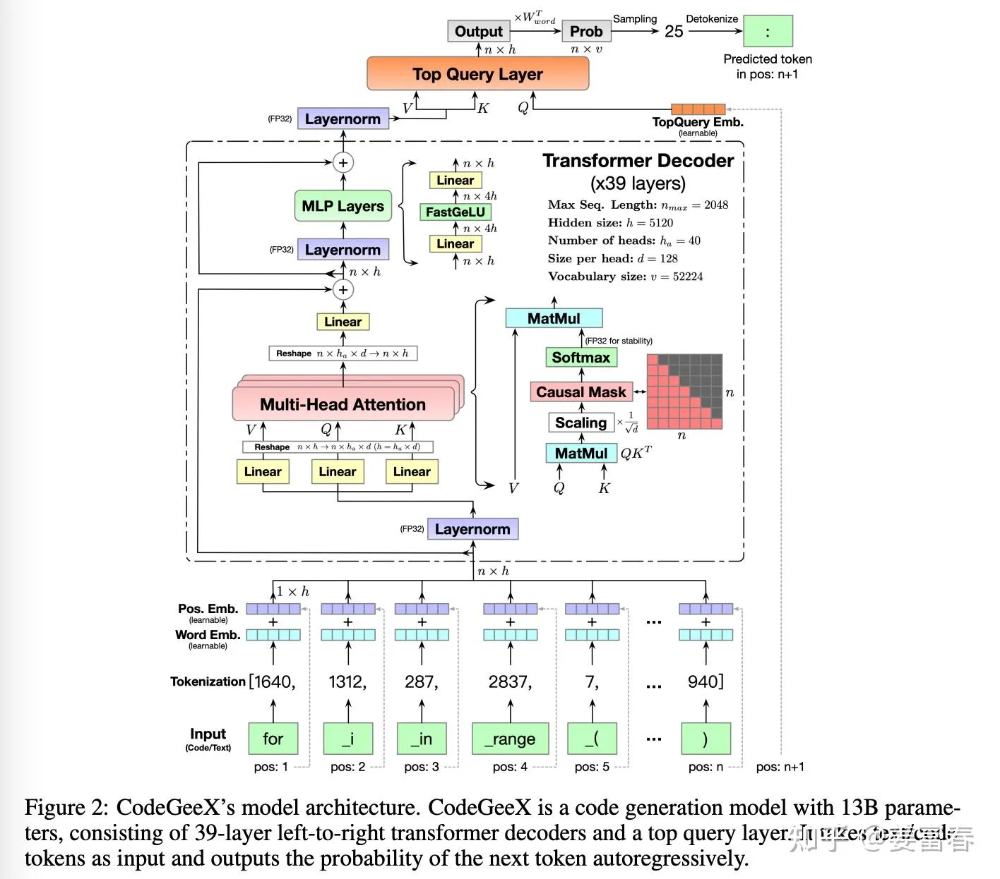

# 基于torch的transformer模型

## 前言

原版论文：[Attention Is All You Need](https://arxiv.org/abs/1706.03762)

Transformer名称的来源 - 每一层将一个sequence变为另一个sequence

## 重要组件

1. **Tokenizer**

    pass

2. **Input Embedding**

    功能：将输入的词索引转换为词向量

3. **Positional Encoding**

    功能：为输入的词向量添加位置信息

    方法：
    - 使用正弦和余弦函数生成位置编码

      $$PE(pos, 2i) = \sin\left(\frac{pos}{10000^{\frac{2i}{d_{\text{model}}}}}\right)$$

      $$PE(pos, 2i+1) = \cos\left(\frac{pos}{10000^{\frac{2i}{d_{\text{model}}}}}\right)$$

      pos - 输入的词索引

      i - 输入的维度索引

      d_model - 输入的维度

    - 可学习参数

4. **Layer Normalization**

    功能：对输入的词向量进行归一化

    公式：

    $$LN(x) = \frac{x - \mu}{\sqrt{\sigma^2 + \epsilon}} * \gamma + \beta$$

    μ - 输入的均值

    σ - 输入的标准差

    γ - 可学习参数

    β - 可学习参数

